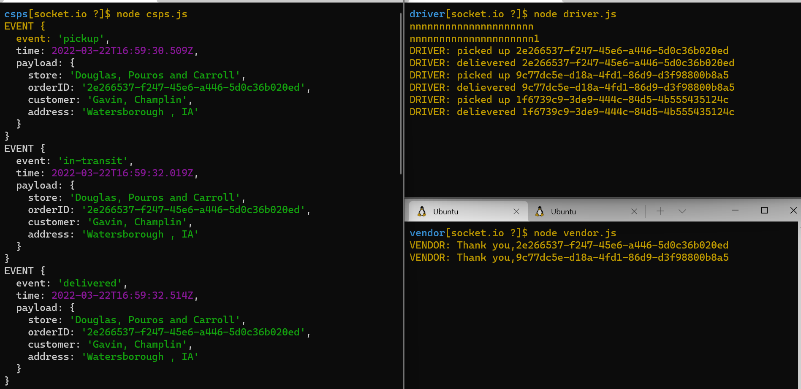
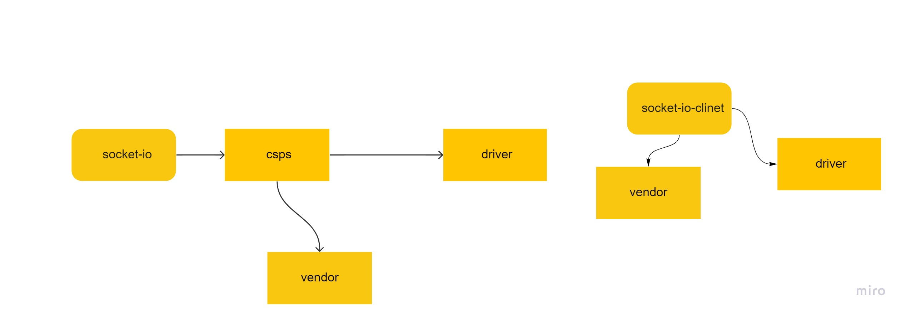

# caps-Socket-io

## Event Driven Applications

**CAPS Phase 2:**
*Continue working on a multi-day build of our delivery tracking system, creating an event observable over a network with Socket.io.*

## Business Requirements for this code
- [x] As a vendor, I want to alert the system when I have a package to be picked up.
- [x] As a driver, I want to be notified when there is a package to be delivered.
- [x] As a driver, I want to alert the system when I have picked up a package and it is in transit
- [x] As a driver, I want to alert the system when a package has been delivered.
- [x] As a vendor, I want to be notified when my package has been delivered.

## what I have in this code

+ 
+ at Module folder i have `driver`,`vender`
+ i have `csps.js` to Listens to ALL events in the Event Pool.and Logs a timestamp and the payload of every event.

## UML

+ [pull req]()
+ [actions]()